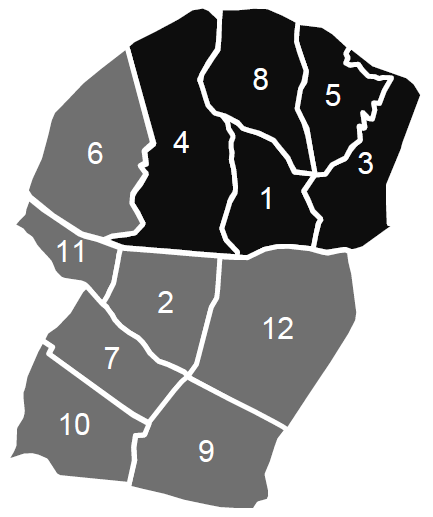
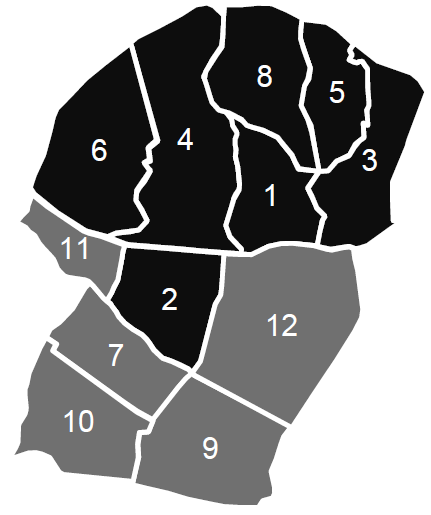

# Tabu-Search-Implementation
Implementation of the tabu search algorithm used in my thesis. The problem in the thesis is political districting. 

## Tabu Search Algorithm Pseudocode

  

## Initialization Functions

A three-step initialization approach to have the required initial solutions efficiently has been developed.
At the first step, a random unit is chosen as the seed of the district and extended
this district by adjoining to seed one of its adjacent units. The district is complete whenever
its population attains the average population value or when no adjacent units are
available. There are 3 possible cases after assigning all the existing units. The total number
of districts can be lower than the desired value, equal to the value or greater than the
value. If the number of districts is lower than the desired value, the algorithm gradually
increases it by iteratively splitting the most populated district into two, while preserving
contiguity. If the number of districts is greater than the desired value, which happens
almost all the time, the algorithm reduces it by iteratively merging the least populated
district with its least populated neighbor.

After these two steps, one more step is added to the initialization procedure to have feasible
solutions. Population equality constraint cannot be achieved after the first two steps.
In order to satisfy this equality, a unit which is in a highly- populated district is assigned
to a district which is neighbor and least populated. We are trying to minimize the variance
of population values of all districts by using the third initialization step.

## Neighborhood Structure

  

    
  

  

    
  

  

    
  

