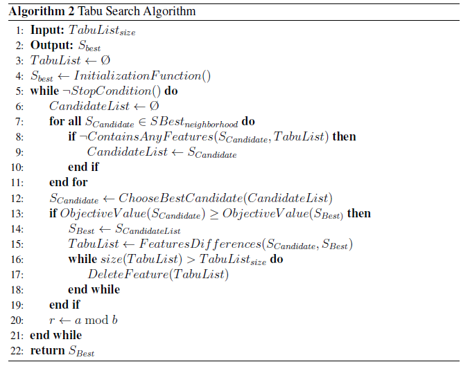
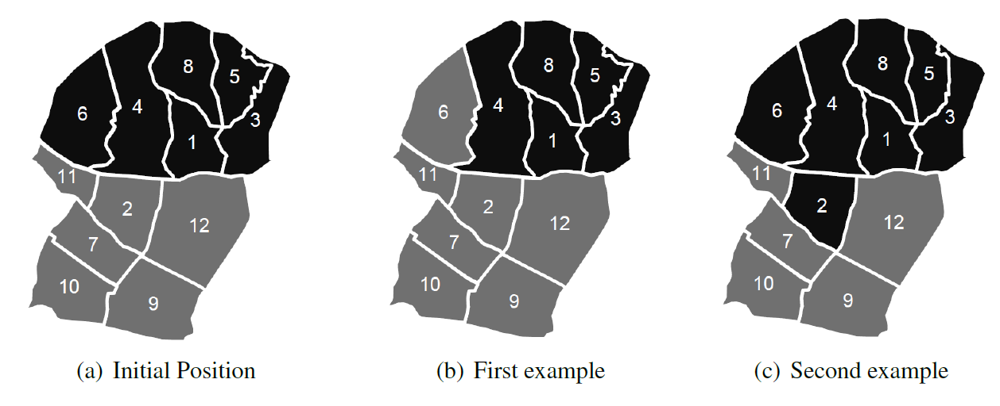
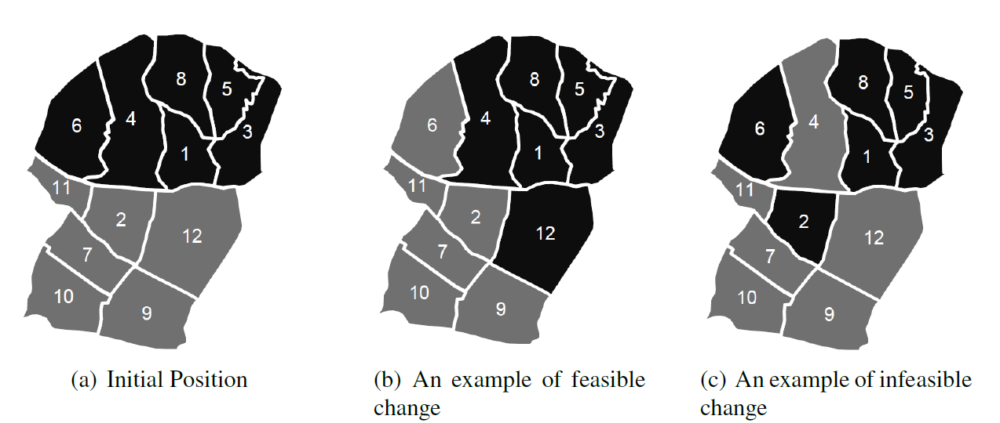
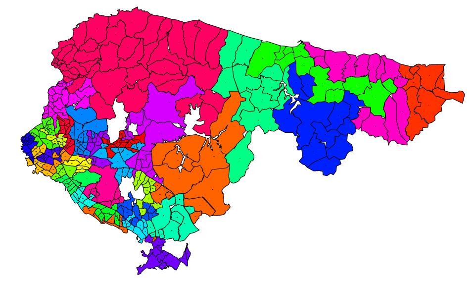
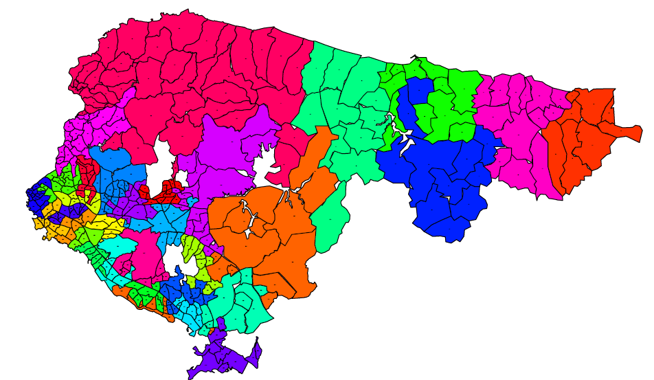

# Tabu-Search-Implementation
Implementation of the tabu search algorithm used in my thesis. The problem in the thesis is political districting. A detailed explanation of the problem can be found under the "Thesis" folder above. 

Most of the functions used in the algorithm can be found in "TabuFunctions.R" file. Some of the files are for the visualization of the solutions.

## Tabu Search Algorithm Pseudocode

  

## Initialization Functions

A three-step initialization approach to have the required initial solutions efficiently has been developed.
At the first step, a random unit is chosen as the seed of the district and extended
this district by adjoining to seed one of its adjacent units. The district is complete whenever
its population attains the average population value or when no adjacent units are
available. There are 3 possible cases after assigning all the existing units. The total number
of districts can be lower than the desired value, equal to the value or greater than the
value. If the number of districts is lower than the desired value, the algorithm gradually
increases it by iteratively splitting the most populated district into two, while preserving
contiguity. If the number of districts is greater than the desired value, which happens
almost all the time, the algorithm reduces it by iteratively merging the least populated
district with its least populated neighbor.

After these two steps, one more step is added to the initialization procedure to have feasible
solutions. Population equality constraint cannot be achieved after the first two steps.
In order to satisfy this equality, a unit which is in a highly- populated district is assigned
to a district which is neighbor and least populated. We are trying to minimize the variance
of population values of all districts by using the third initialization step.

## Neighborhood Structure 

2 different neighborhood structures are utilized in the algorithm. All changes are between
two neighboor districts. In the first one, one of the adjacent units between two districts is
assigned to the neighbor district. The structure is shown below. There are 2 adjacent
districts that are colorized by black and gray. In the second picture the unit number 6 is assigned
to the gray district and unit number 2 is assigned to the black district in the third figure.

  

Another neighborhood is swap-based. One each unit from two districts
are assigned to the opposite districts. For example unit number 6 and 12 are swapped
and shown below. As might be expected, some of changes are infeasible solutions.
One of infeasible changes is shown in the last picture below. In the algorithm, a contiguity control
approach is used to eliminate these infeasible moves.

  

## Results

### Initial Solution

  

### Solution after Running the Algorithm

  

